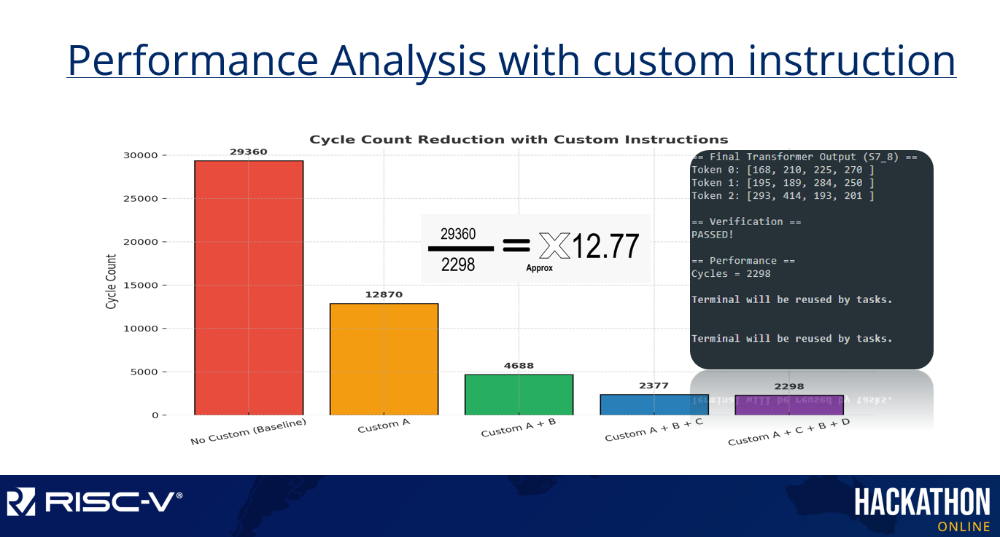

# 🚀 RISC-V Hackathon — Codasip Challenge  

## 📄 Problem Details  
This project was created for the **RISC-V Hackathon Online** under the **Codasip track**.  
👉 Official Hackathon Website: [RISC-V Hackathon Online](https://community.riscv.org/events/details/risc-v-international-risc-v-academy-presents-risc-v-hackathon-online/)  
👉 Hackathon Material & Instructions: [Google Drive Link](https://drive.google.com/drive/u/0/folders/12udrh8lS_-z2D6IOP6jJ5xWX0-KhPNoS)

---

## 🛠️ How to Use Codasip Studio  

**Codasip Studio** is a tool for software/hardware co-design, allowing developers to:
- Create and modify custom CPU architectures.
- Define custom instructions.
- Co-develop software that runs efficiently on the designed CPU.

**How to access Codasip Studio:**
1. Visit the official website: [https://www.codasip.com](https://www.codasip.com)
2. Download and install Codasip Studio as per the instructions in the [Google Drive Link](https://drive.google.com/drive/u/0/folders/12udrh8lS_-z2D6IOP6jJ5xWX0-KhPNoS).

Inside Codasip Studio:
- **`hackathon_sw` project** contains the C software implementation.
- **`codasip_urisc_v` project** contains the CPU description and custom ISA definitions.

---

## 🤖 What is a Transformer and LLM?  

### 📚 Large Language Models (LLMs)
Large Language Models (LLMs) like **GPT** and **BERT** are AI systems trained on huge amounts of text data. They can:
- Understand context in sentences.
- Generate human-like text.
- Perform tasks like translation, summarization, and question-answering.

These models use the **Transformer architecture** under the hood.

---

### 🏗️ Transformer Architecture 
A **Transformer** processes sequences (like sentences) using the following steps:
1. **Token Embedding:** Convert each word into a vector (numbers representing meaning).
2. **Self-Attention:** Each word looks at other words in the sentence to understand context.
3. **Feed-Forward Layers:** Transform these context-aware vectors independently.
4. **Residual Connections:** Add the original input back to the processed output to retain important information.
5. **Final Output:** A new set of vectors for each word, now aware of the entire sentence.

In real-world applications, these models use:
- Multi-head Attention
- Layer Normalization
- Positional Encoding  
But for simplicity, this hackathon project uses a basic version.

---

## 🎯 Hackathon Problem Statement  

In this Codasip Hackathon:
- We are provided with a **simplified Transformer encoder implementation** in C.
- The goal is to **optimize specific computational functions** within the code by:
  - Customizing the CPU using **Codasip Studio**.
  - Implementing **single-cycle custom instructions**.
  - Speeding up operations like matrix-vector multiplications, dot products, and vector additions.
## Getting Started with the Hackathon

### Step 1: Clone and Set Up the Project
- Go to: [https://github.com/TadejMurovic/riscv_academy_hackathon_april_2025](https://github.com/TadejMurovic/riscv_academy_hackathon_april_2025)

- Open **Studio in the Cloud**.
- If no terminal is visible, go to **Terminal → New Terminal** to open one.

### Step 2: Explore the Project Structure
- Inside the project, locate the `codasip_urisc_v` project.  
- Here you will find the **CPU description and model** that will execute your code.

### Step 3: Understand the Development Approach
- Studio enables **SW/HW co-design**:  
  You can modify both software and hardware to optimize your algorithms.
- For simplicity, you will focus on developing **custom single-cycle instructions**.

### Step 4: Important Files to Check
- **Software:**  
  Navigate to: `hackaton_sw/src/main.c`  
  ➔ This contains the initial transformer implementation.

- **Hardware (Custom Instructions):**  
  Navigate to: `codasip_urisc_v/model/share/isa/isa_hackaton.codal`  
  ➔ This is where you will define and modify your CPU's custom instructions.
## How to Use My Solution

### Step 1: Copy Files
- Go to the `Codes` folder.
- Copy the following files:
  - `main.c` ➔ Copy this into: `hackaton_sw/src/main.c`
  - `isa_hackaton.codal` ➔ Copy this into: `codasip_urisc_v/model/share/isa/isa_hackaton.codal`

### Step 2: Regenerate the Project
- After replacing the files, regenerate the CPU model to apply the new hardware description.
- This will update the CPU to include the new custom instructions.

### Step 3: Build and Run
- Build the project.
- Run the simulation to verify the updated behavior and performance improvements using the custom instructions.

## 📊 Results

After integrating the custom single-cycle instructions into the CPU model, a significant performance improvement was achieved.

The figure below shows the result:



By carefully designing and utilizing the custom instructions, we were able to **reduce the CPU cycle count from approximately 29,360 cycles to just 2,298 cycles**.  
This translates to an **~13× improvement in execution efficiency** for the target workload.


---


| Version            | CPU Cycles |
|--------------------|------------|
| Before Optimization | 29,360     |
| After Optimization  | 2,298      |
| Improvement         | ~13×       |


# Custom RISC-V Instructions for Transformer Encoder Optimization

This section documents the **custom RISC-V instructions** added for accelerating Transformer encoder operations.

---

## ISA Extension: `i_ext_hackaton`

We define 5 custom instructions inside a new instruction set extension `i_ext_hackaton`.

### Instruction Groups

```c
DEF_OPC_GROUP(opc_hackaton_custom_i, hackaton_custom_a, "hackaton_custom_instr_a", OPC_HACKATON_CUSTOM_A)
DEF_OPC_GROUP(opc_hackaton_custom_i, hackaton_custom_b, "hackaton_custom_instr_b", OPC_HACKATON_CUSTOM_B)
DEF_OPC_GROUP(opc_hackaton_custom_i, hackaton_custom_c, "hackaton_custom_instr_c", OPC_HACKATON_CUSTOM_C)
DEF_OPC_GROUP(opc_hackaton_custom_i, hackaton_custom_d, "hackaton_custom_instr_d", OPC_HACKATON_CUSTOM_D)
DEF_OPC_GROUP(opc_hackaton_custom_i, hackaton_custom_e, "hackaton_custom_instr_e", OPC_HACKATON_CUSTOM_E)
```

### Set ISA Extension

```c
set isa += i_ext_hackaton;
```

---

## Definition of `i_ext_hackaton`

```c
element i_ext_hackaton
{
    use opc_hackaton_custom_i as opc;
    use reg_any as rs_1, rs_2, dst;

    assembly { opc dst "," rs_1 "," rs_2 };
    binary { 0:bit[7] rs_2 rs_1 opc dst OPC_HACKATON };

    semantics
    {
        int32 result, s1, s2, s3;
        int32 simd_a0, simd_a1, simd_b0, simd_b1, accumulator;
        int64 summa;

        s1 = rf_gpr_read(rs_1);
        s2 = rf_gpr_read(rs_2);
        s3 = rf_gpr_read(dst);

        switch (opc)
        {
            case OPC_HACKATON_CUSTOM_A:
                // Perform Multiply-Accumulate with Shift
                result = s3 + ((s1 * s2) >> 8);
                break;

            case OPC_HACKATON_CUSTOM_B:
                // Scaling operation using shift and division
                result = (s1 << 8) / s2;
                break;

            case OPC_HACKATON_CUSTOM_C:
                // Clamp operation: if s1 < s2, return s2; else return s1
                result = (s1 < s2) ? s2 : s1;
                break;

            case OPC_HACKATON_CUSTOM_D:
                // Simple addition of two operands
                result = s1 + s2;
                break;

            case OPC_HACKATON_CUSTOM_E:
                // Floating-point to fixed-point conversion with rounding
                float fx = *((float*)&s1);
                int32_t scale = s2;
                float fq = (float)scale;
                float r = (fx >= 0.0f) ? 0.5f : -0.5f;
                int32_t q = (int32_t)(fx * fq + r);
                result = (q > 32767) ? 32767 : (q < -32768 ? -32768 : q);
                break;

            default:
                result = 0;
                break;
        }

        rf_gpr_write(dst, result);
    };
};
```

---

## Summary of Custom Instructions

| Instruction                     | Purpose                                        |
| :------------------------------- | :--------------------------------------------- |
| `hackaton_custom_instr_a`         | Multiply two operands, shift right by 8, then add to accumulator. |
| `hackaton_custom_instr_b`         | Scale an operand using shift-left and divide.  |
| `hackaton_custom_instr_c`         | Clamp operand to minimum or maximum threshold. |
| `hackaton_custom_instr_d`         | Add two operands.                             |
| `hackaton_custom_instr_e`         | Convert floating-point to quantized fixed-point with rounding and saturation. |

---

# Notes
- **Registers**: `rs_1`, `rs_2`, `dst` are standard RISC-V GPRs (General Purpose Registers).
- **Format**: Assembly format follows `instruction dst, rs1, rs2`.
- **Binary Encoding**: Uses custom OPC_HACKATON field in the instruction word.

---
```

## Original
```c
int16_t saturate_i16(int32_t x) {
    if (x > 32767) return 32767;
    if (x < -32768) return -32768;
    return (int16_t)x;
}
```

## Updated
```c
int16_t saturate_i16(int32_t x) {
    int16_t res;
    asm volatile("hackaton_custom_instr_c %0, %1, %2" : "=r"(res) : "r"(x), "r"(-32768));
    asm volatile("hackaton_custom_instr_c %0, %1, %2" : "=r"(res) : "r"(res), "r"(32767));
    return res;
}
```

### Intuition
Replacing two `if` conditions with two **custom clamp instructions** removes branching, leading to faster and more predictable saturation.

---

## 2. `dot_S7_8`

### Original
```c
int16_t dot_S7_8(const int16_t *a, const int16_t *b, int size) {
    int32_t acc = 0;
    for (int i = 0; i < size; i++) {
        acc += (a[i] * b[i]) >> 8;
    }
    return saturate_i16(acc);
}
```

### Updated
```c
int16_t dot_S7_8(const int16_t *a, const int16_t *b, int size) {
    int32_t acc = 0;
    for (int i = 0; i < size; i++) {
        int32_t tmp = (a[i] * b[i]) >> 8;
        asm volatile("hackaton_custom_instr_a %0, %1, %2" : "+r"(acc) : "r"(acc), "r"(tmp));
    }
    return saturate_i16(acc);
}
```

### Intuition
Instead of separate multiplication and addition, using a **custom MAC instruction** directly accumulates products faster, optimizing critical dot product calculations.

---

## 3. `matvec_mul_S7_8`

### Original
```c
void matvec_mul_S7_8(const int16_t *mat, const int16_t *vec, int16_t *out, int rows, int cols) {
    for (int i = 0; i < rows; i++) {
        int32_t acc = 0;
        for (int j = 0; j < cols; j++) {
            acc += (mat[i * cols + j] * vec[j]) >> 8;
        }
        out[i] = saturate_i16(acc);
    }
}
```

### Updated
```c
void matvec_mul_S7_8(const int16_t *mat, const int16_t *vec, int16_t *out, int rows, int cols) {
    for (int i = 0; i < rows; i++) {
        int32_t acc = 0;
        for (int j = 0; j < cols; j++) {
            int32_t tmp = (mat[i * cols + j] * vec[j]) >> 8;
            asm volatile("hackaton_custom_instr_a %0, %1, %2" : "+r"(acc) : "r"(acc), "r"(tmp));
        }
        out[i] = saturate_i16(acc);
    }
}
```

### Intuition
Matrix-vector multiplication is compute-heavy.  
By using the **inline MAC instruction** during accumulation, we significantly reduce the number of instructions and speed up the entire operation.

---

## 4. `fake_softmax_S7_8`

### Original
```c
void fake_softmax_S7_8(int16_t *scores, int size) {
    int32_t sum = 0;
    for (int i = 0; i < size; i++) {
        if (scores[i] < 0) scores[i] = 0;
        sum += scores[i];
    }
    for (int i = 0; i < size; i++) {
        scores[i] = (scores[i] * Q_SCALE) / sum;
    }
}
```

### Updated
```c
void fake_softmax_S7_8(int16_t *scores, int size) {
    int32_t sum = 0;
    for (int i = 0; i < size; i++) {
        asm volatile("hackaton_custom_instr_c %0, %1, %2" : "=r"(scores[i]) : "r"(scores[i]), "r"(0));
        asm volatile("hackaton_custom_instr_d %0, %0, %1" : "+r"(sum) : "r"(scores[i]));
    }
    for (int i = 0; i < size; i++) {
        asm volatile("hackaton_custom_instr_b %0, %1, %2" : "=r"(scores[i]) : "r"(scores[i]), "r"(sum));
    }
}
```

### Intuition
- **ReLU** is made branch-free using a clamp-to-zero instruction.  
- **Summation** uses an addition-specific custom instruction.  
- **Normalization** uses a custom scaling operation, combining multiplication and division for faster softmax approximation.

---

## 5. `single_head_attention_S7_8`

### Original
```c
void single_head_attention_S7_8(...) {
    // Dot Q and K
    // Apply softmax
    // Multiply with V
}
```

### Updated
```c
void single_head_attention_S7_8(...) {
    // Use optimized dot_S7_8
    // Use optimized fake_softmax_S7_8
    // Multiply with V using inline MAC
}
```

### Intuition
Attention is mostly **dot products** and **softmax normalization**.  
By optimizing the core dot-product and normalization steps, we greatly improve performance of the attention block without changing the high-level flow.

---


